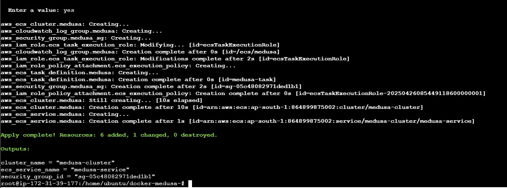
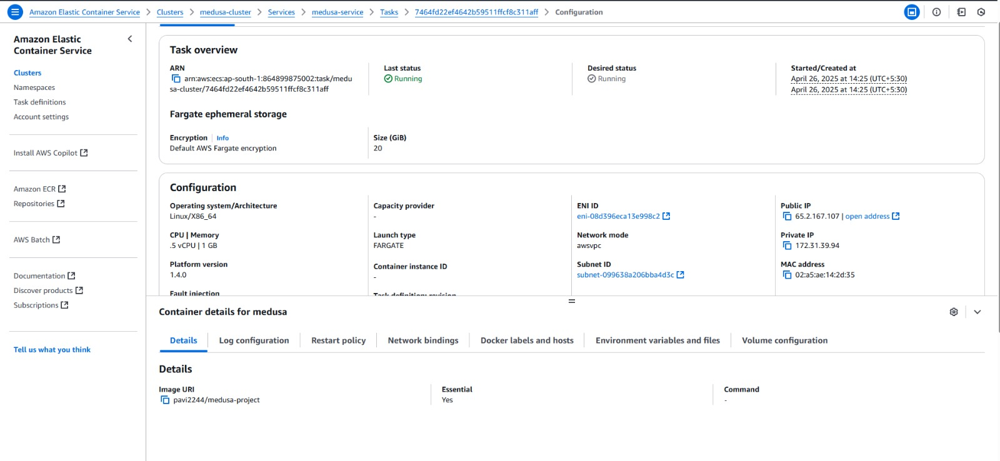
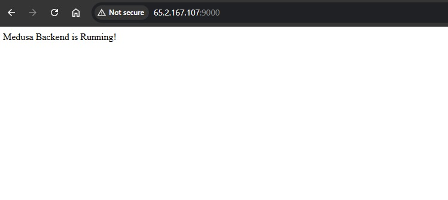

# 🚀 Medusa Backend Deployment on AWS ECS Fargate

This project demonstrates the deployment of a **Medusa headless commerce backend** using **Terraform**, **Docker Hub**, **GitHub Actions**, and **AWS ECS Fargate**.

We containerized the backend, automated the build and delivery pipeline, provisioned cloud infrastructure with code, and achieved a fully serverless deployment — following modern DevOps practices.

---

## 🛠️ Key Highlights

- **Infrastructure as Code**: Terraform provisions VPC, ECS Cluster, Task Definition, and Security Groups.
- **CI/CD Automation**: GitHub Actions builds and pushes Docker images to Docker Hub on every code change.
- **Serverless Deployment**: Medusa backend runs on AWS Fargate with public IP access (port 9000).
- **Production-Ready Architecture**: Scalable, efficient, and easy to manage.

---

## ⚡ Workflow Overview

1. Clone the GitHub repository.
2. Configure Docker username and token secrets in GitHub.
3. Use Terraform to provision cloud infrastructure.
4. GitHub Actions builds and pushes Docker image to Docker Hub.
5. ECS Fargate service pulls the image and runs the backend automatically.

---

# 📸 Project Snapshots

### TERRAFORM INFRASTRUCTURE PROVISIONING

---

### ECS SERVICE AND TASK RUNNING SUCCESSFULLY

---

### MEDUSA BACKEND LIVE ON PUBLIC IP (PORT 9000)

---

# 📢 Learn More

👉 **To know more about this project in detail, visit the [GitHub README](https://github.com/amie2001/docker-medusa-/blob/project/README.md)**

---

# ✨ Thank you for visiting!
